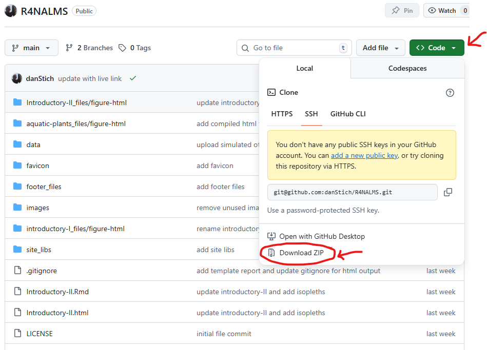

# R4NALMS

Files and GitHub page related to R workshops for the 
International North American Lake Management Society (NALMS) 
Symposium

## Workshop participants
All data and code files needed for both sessions are 
located above. You can download the workshop content as a 
compressed (ZIP) folder by clicking on the green "code" button 
and choosing "Download ZIP" in the drop down menu that appears. 
The screenshot below demonstrates this.

## Repository structure
Files in the main directory include `rmarkdown` (.Rmd) files used to 
generate web pages (.html) that are managed and styled through 
YAML and CSS code.

Most folders (sub-directories) include `site_libs` and cached files 
for markdown-generated html pages, all of which is 
generated using `render_site()` from the `rmarkdown` package.

The `data` sub-directory contains data used for workshop examples.

The `image` sub-directory contains images used in rendered websites.