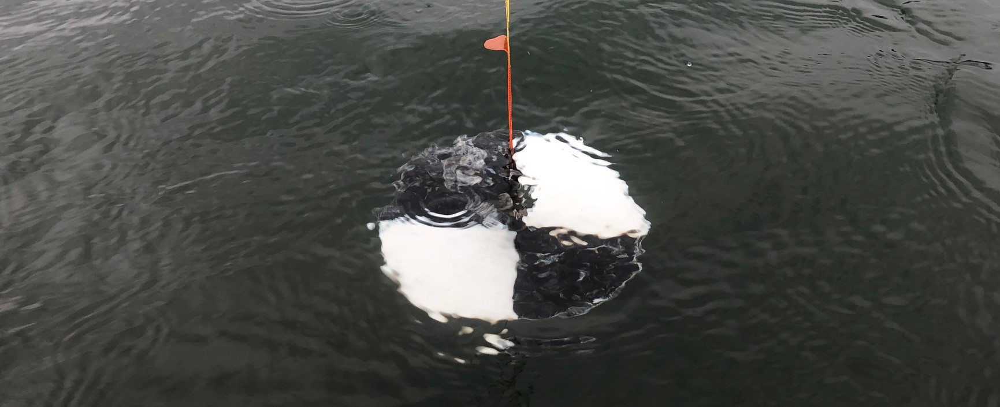

```{r, child="_styles.Rmd"}
```

---
title: Applications of R for Aquatic Plant Data
---



The Applications of R for Aquatic Plant Data workshop will expand on the Introduction to R for Aquatic Research workshop and demonstrate some of the powerful tools available through worked examples. It is our hope that by the end of this session, you will be comfortable conducting some basic analyses and producing related graphics. During this session, you will be exposed to more data manipulation in the `tidyverse`, statistical analyses, and a whole lot of plotting using the powerful utilities provided through the `ggplot2` package. This workshop assumes a basic understanding of elementary statistics, and working knowledge of R and Rstudio. Those attending the Introduction to R for Aquatic Research will be sufficiently prepared for this workshop.

<!-- The tutorial for this workshop is located <a href="aquatic-plants.html"> here </a>. -->

<!-- The data and code files needed for both workshops are located <a href="https://github.com/danStich/data4_r4nalms"> here </a>. -->

<br>
